# Data flow

Horizontal end-to-end data flow of the repo. Rectangles are scripts, cylinders
are data artifacts (files/dirs/DB tables), and each stage is a stacked column.
Solid arrows are the default path; dashed arrows are opt-in or external.

```mermaid
flowchart LR

  %% ───────────────── Committed / external inputs ─────────────────
  subgraph IN["Inputs"]
    direction TB
    zips[("inputs/*.zip<br/>bulk_fuel_data ·<br/>data_for_network_build ·<br/>region_and_census_data")]
    rasters[("inputs/friction_rasters/<br/>(external — see EXTERNAL_DATA.md)")]
    frozen[("final_network/*.zip<br/>frozen network-of-record<br/>(PRE-FIX)")]
  end

  extract["tools/extract_inputs.py"]
  zips --> extract
  extract --> raw[("data/raw/")]

  %% ───────────────── Stage 01 — friction build ─────────────────
  subgraph S01["01_friction_build"]
    direction TB
    p00["00_preflight_inputs.py<br/>grid + range gates"]
    p01["01_build_corridor_masks.py<br/>75 m waterway buffer"]
    p02["02_build_friction_stack.py<br/>overland + road_base + barge_01..12"]
    p03["03_qa_friction_stack.py<br/>hard gates"]
    p00 --> p01 --> p02 --> p03
  end
  rasters -.-> p00
  p01 --> mask[("waterway_mask_150m.tif")]
  mask --> p02
  p02 --> stack[("outputs/01_friction_build/<br/>friction_stack/<br/>14 TIFs / 24 surfaces")]

  %% ───────────────── Stage 02 — network build ─────────────────
  subgraph S02["02_network_build"]
    direction TB
    n00["00_normalize_raw.py<br/>SPEC table → EPSG:3338"]
    n01["01_prep_waterway.py<br/>full-AK NWN, ~31,903 km"]
    n02["02_prep_airways.py<br/>geocode OD legs"]
    n03["03_fetch_basemap.py<br/>(figures only)"]
    n04["04_build_network.py<br/>mmnet stages 01→04"]
    n05["05_verify_north_slope.py<br/>connectivity gate"]
    n06["06_export_final_network.py<br/>opt-in: EXPORT_FINAL_NETWORK=1"]
    n00 --> n01 --> n02 --> n04 --> n05 -.-> n06
    n03 -.-> n04
  end
  raw --> n00
  n00 --> interim[("data/interim/<br/>+ MANIFEST · ak_waterway.gpkg")]
  n02 --> airgeo[("data/processed/<br/>airways · air_nodes ·<br/>boundary.geojson")]
  interim --> n04
  airgeo --> n04
  profile[("profile.yaml<br/>THE config surface")] --> n04
  n04 --> netout[("outputs/02_network_build/<br/>output · reports")]
  n06 -.->|"re-export = NEW<br/>network-of-record<br/>(CAUTION)"| reexport[("final_network/*.zip<br/>(replaced)")]
  reexport -.->|"next run"| j01

  %% ───────────────── Stage 03 — multimodal join ─────────────────
  subgraph S03["03_multimodal_join"]
    direction TB
    j01["01_extract_network_handoff.py<br/>unzip frozen handoff"]
    j02["02_load_final_network.py<br/>integrity tripwire · edge_id · edge_class"]
    j03["03_weight_network_edges.py<br/>75 m friction sampling / edge-month"]
    j04["04_assemble_weighted_graph.py<br/>$-rates × friction → nx.MultiGraph"]
    j01 --> j02 --> j03 --> j04
  end
  frozen --> j01
  j01 --> shp[("final_network/*/<br/>extracted shapefiles")]
  shp --> j02
  stack --> j03
  fcosts[("friction_costs.py<br/>every dollar lives here")] --> j04

  %% ───────────────── DuckDB + Stage 04 ─────────────────
  subgraph DB["outputs/fuel_network.duckdb"]
    direction TB
    tnodes[("network_nodes ·<br/>network_edges")]
    tweights[("edge_month_weights<br/>1,091,052 rows")]
    tcosts[("edge_costs<br/>1,091,052 rows")]
  end
  j02 --> tnodes
  j03 --> tweights
  tnodes --> j03
  tweights --> j04
  j04 --> tcosts

  subgraph S04["04_duckdb_export"]
    direction TB
    v01["01_run_validation_queries.py<br/>monthly passability by mode"]
    v02["02_inspect_schema.py<br/>schema / count dump"]
  end
  DB --> v01
  DB --> v02
```

## Reading notes

- **Two parallel front halves.** Stage 01 (friction rasters) and stage 02
  (vector network) are independent until stage 03 joins them: the frozen
  network geometry gets per-edge-month friction weights sampled from the
  stage-01 stack, then dollar costs from `friction_costs.py`.
- **The dashed `06_export → final_network` edge is deliberate.** Stage 03
  consumes the *committed, frozen* `final_network/*.zip` (built pre-bugfix),
  not fresh stage-02 output. Re-exporting is opt-in
  (`EXPORT_FINAL_NETWORK=1`) and replaces the network-of-record — see
  `final_network/README.md` and the caution rows in `CLAUDE.md`.
- **Config surfaces:** `profile.yaml` (network topology, region-as-data),
  `friction_config.py` (friction constants, feeds stage 01),
  `friction_costs.py` (all dollars, feeds stage 03/04 assembly).
- **Drivers:** `run_all.sh` chains the four stage `run_all.sh` scripts; all
  five source `workflows/_lib.sh` (`resolve_python`, `run_step`, `gate`).
