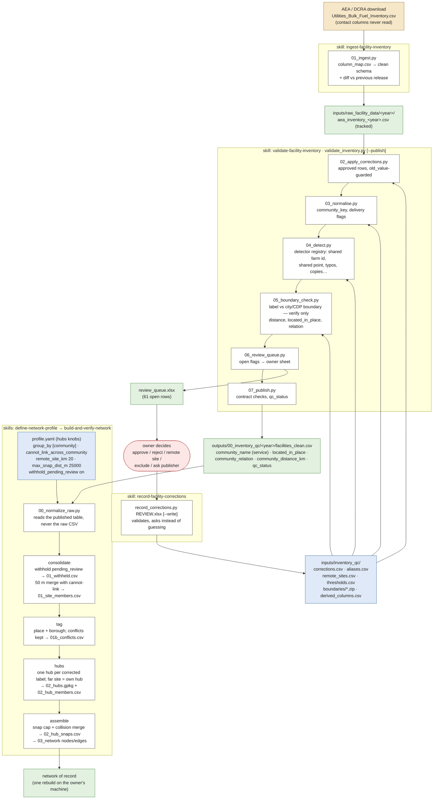

# Facility inventory → hubs: skills, scripts and data

**Reading it.** Yellow is the untouched download. Blue is owner-controlled configuration, the only place anything is ever changed. White boxes are scripts, grouped by the skill that drives them. Green is a tracked or generated output. The red loop is the one human step: the queue goes out, decisions come back as rows of the configuration, and the next run applies them. Nothing moves, relabels or drops a record except an approved row in that configuration; the build withholds what is still undecided.
